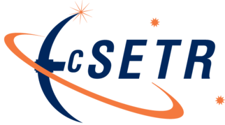

# cSTER Devices DC Brushed Motor with Encoders Library

<!-- Replace w/doxygen images -->
<!-- @image html cSTER_logo.png
@image latex cSTER_logo.png -->

  

## Description
This section contains the device drivers for Motor with encoders, and PID controller. There are few examples in  `examples`
which demostrate different applications of motors, encoders, and PID. 

## Examples
- motor_with_pid.c
- multiple_motor_example.c
- multiple_motor_pid_experiment.c
- pid_experiment.c
- single_motor_example.c
- step_reponse.c
